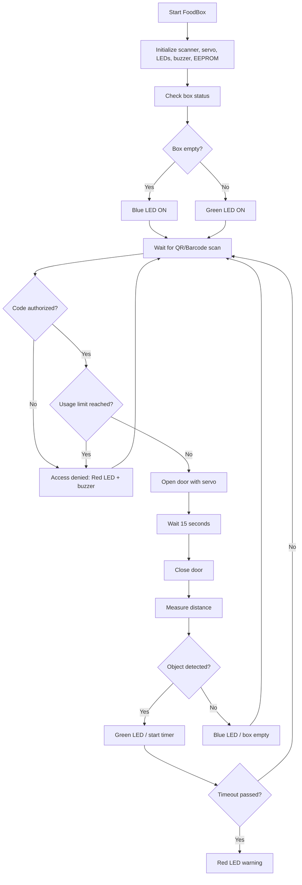

# 📦 Smart Donation FoodBox

**QR/Barcode-Controlled Community Food Locker**

Open-source εκπαιδευτικό σύστημα ελεγχόμενης πρόσβασης σε θυρίδα δωρεάς τροφίμων, με barcode/QR scanner, servo lock, αισθητήρα πληρότητας, LED ενδείξεις, buzzer και καταγραφή χρήσεων σε EEPROM.

---

## 1. Σύντομη περιγραφή

Το **Smart Donation FoodBox** είναι ένα εκπαιδευτικό, open-source πρωτότυπο που σχεδιάστηκε και υλοποιήθηκε από μαθητές Γυμνασίου με στόχο να προσομοιώσει ένα απλό σύστημα δωρεάς και παραλαβής τροφίμων με ελεγχόμενη πρόσβαση.

Το σύστημα λειτουργεί ως έξυπνη θυρίδα τροφίμων. Ο χρήστης σαρώνει ένα έγκυρο QR/barcode και, εφόσον ο κωδικός είναι εξουσιοδοτημένος, ανοίγει η θυρίδα μέσω servo μηχανισμού. Το σύστημα ελέγχει αν η θυρίδα είναι άδεια ή γεμάτη με αισθητήρα απόστασης, εμφανίζει την κατάσταση με LEDs και χρησιμοποιεί buzzer για ηχητική ειδοποίηση.

Το έργο έχει καθαρά εκπαιδευτικό χαρακτήρα. Δεν αποτελεί πιστοποιημένο σύστημα αποθήκευσης τροφίμων, δεν εγγυάται την ασφάλεια ή καταλληλότητα τροφίμων και δεν αποθηκεύει προσωπικά δεδομένα.

---

## 2. Κατάσταση έργου

**Κατάσταση:** Ολοκληρωμένο εκπαιδευτικό πρωτότυπο

Το έργο ολοκληρώθηκε σε επίπεδο λειτουργικής μακέτας / πρωτοτύπου. Η τελική έκδοση περιλαμβάνει:

* barcode/QR scanner,
* servo μηχανισμό ανοίγματος,
* αισθητήρα απόστασης για ανίχνευση αντικειμένου,
* LED ενδείξεις κατάστασης,
* buzzer για ηχητική ειδοποίηση,
* EEPROM counters για καταγραφή χρήσεων ανά εξουσιοδοτημένο κωδικό,
* έλεγχο έγκυρου / άκυρου κωδικού,
* όριο χρήσεων ανά κωδικό,
* αυτόματο κλείσιμο θυρίδας μετά από συγκεκριμένο χρόνο.

Το πρωτότυπο είναι λειτουργικό σε εκπαιδευτικό περιβάλλον και μπορεί να παρουσιαστεί ως ολοκληρωμένη μακέτα ανοιχτής τεχνολογίας για κοινωνικό σκοπό.

---

## 3. Πρόβλημα που επιχειρεί να αντιμετωπίσει

Η σπατάλη τροφίμων και η άνιση πρόσβαση σε βασικά αγαθά αποτελούν σημαντικά κοινωνικά ζητήματα. Πολλά τρόφιμα που θα μπορούσαν να αξιοποιηθούν καταλήγουν να απορρίπτονται, ενώ ταυτόχρονα υπάρχουν άνθρωποι ή οικογένειες που χρειάζονται υποστήριξη.

Το Smart Donation FoodBox προσεγγίζει εκπαιδευτικά αυτό το πρόβλημα, προτείνοντας ένα απλό σύστημα ελεγχόμενης πρόσβασης σε θυρίδα δωρεάς τροφίμων.

Η ιδέα δεν αντικαθιστά κοινωνικές υπηρεσίες, δομές αλληλεγγύης ή φορείς διανομής τροφίμων. Αντίθετα, λειτουργεί ως σχολικό πρωτότυπο που βοηθά τους μαθητές να κατανοήσουν πώς η τεχνολογία μπορεί να υποστηρίξει δράσεις κοινωνικής προσφοράς.

---

## 4. Εκπαιδευτικός στόχος

Μέσα από την υλοποίηση του έργου, οι μαθητές ήρθαν σε επαφή με έννοιες όπως:

* κοινωνική αλληλεγγύη,
* μείωση σπατάλης τροφίμων,
* υπεύθυνη χρήση τεχνολογίας,
* αυτοματισμοί,
* embedded systems,
* αισθητήρες και ενεργοποιητές,
* έλεγχος πρόσβασης με QR/barcode,
* σειριακή επικοινωνία,
* EEPROM αποθήκευση δεδομένων,
* μηχανικός σχεδιασμός θυρίδας,
* δοκιμές και βελτιώσεις πρωτοτύπου.

Το έργο εντάσσεται στη λογική των **ανοιχτών τεχνολογιών για το κοινό καλό**, καθώς συνδυάζει τεχνική μάθηση με κοινωνική χρησιμότητα.

---

## 5. Πώς λειτουργεί

Το FoodBox λειτουργεί ως μία ελεγχόμενη θυρίδα.

### 5.1 Άδειο FoodBox

Όταν η θυρίδα είναι άδεια:

* ανάβει το μπλε LED,
* το σύστημα περιμένει σάρωση κωδικού,
* αν ο κωδικός είναι έγκυρος, η πόρτα ανοίγει,
* ο χρήστης τοποθετεί τρόφιμο ή demo αντικείμενο,
* η πόρτα κλείνει αυτόματα,
* ο αισθητήρας ελέγχει αν υπάρχει αντικείμενο μέσα.

### 5.2 Γεμάτο FoodBox

Όταν ανιχνευθεί αντικείμενο μέσα στη θυρίδα:

* ανάβει το πράσινο LED,
* το σύστημα θεωρεί ότι η θυρίδα περιέχει αντικείμενο,
* μετά από συγκεκριμένο χρονικό όριο, αν το αντικείμενο παραμένει μέσα, ανάβει το κόκκινο LED ως εκπαιδευτική προειδοποίηση.

### 5.3 Άκυρος κωδικός

Αν σαρωθεί μη εξουσιοδοτημένος κωδικός:

* η πόρτα δεν ανοίγει,
* ανάβει το κόκκινο LED,
* ενεργοποιείται buzzer,
* εμφανίζεται μήνυμα άρνησης πρόσβασης στο Serial Monitor.

### 5.4 Όριο χρήσεων

Κάθε εξουσιοδοτημένος κωδικός μπορεί να χρησιμοποιηθεί μέχρι συγκεκριμένο αριθμό φορών. Στην τρέχουσα έκδοση το όριο είναι τρεις χρήσεις ανά κωδικό.

Οι μετρητές χρήσης αποθηκεύονται στην EEPROM.

---

## 6. LED ενδείξεις

| Ένδειξη     | Κατάσταση                                            |
| ----------- | ---------------------------------------------------- |
| Μπλε LED    | Η θυρίδα είναι άδεια                                 |
| Πράσινο LED | Υπάρχει αντικείμενο στη θυρίδα                       |
| Κόκκινο LED | Προειδοποίηση ή άρνηση πρόσβασης                     |
| Όλα σβηστά  | Η πόρτα είναι ανοιχτή ή το σύστημα αλλάζει κατάσταση |

Η κόκκινη ένδειξη είναι εκπαιδευτική προειδοποίηση. Δεν αποτελεί έλεγχο καταλληλότητας τροφίμων.

---

## 7. Βασική αρχιτεκτονική

### 7.1 Μικροελεγκτής

* Arduino UNO ή συμβατός μικροελεγκτής

### 7.2 Είσοδοι

* Barcode / QR scanner μέσω SoftwareSerial
* Ultrasonic sensor για ανίχνευση αντικειμένου

### 7.3 Έξοδοι

* Servo motor για άνοιγμα / κλείσιμο πόρτας
* RGB ή ξεχωριστά LEDs κατάστασης
* Buzzer για ηχητικές ειδοποιήσεις
* Serial Monitor για έλεγχο και debugging

### 7.4 Αποθήκευση

* EEPROM για αποθήκευση μετρητών χρήσης ανά κωδικό

---

## 8. Ροή λειτουργίας



---

## 9. Βασικός αλγόριθμος

Ο βασικός αλγόριθμος του συστήματος είναι:

```text
1. Αρχικοποίηση scanner, servo, LEDs, buzzer και EEPROM.
2. Φόρτωση εξουσιοδοτημένων κωδικών και μετρητών χρήσης.
3. Έλεγχος απόστασης με ultrasonic sensor.
4. Εμφάνιση κατάστασης:
   - Μπλε: άδειο
   - Πράσινο: γεμάτο
   - Κόκκινο: προειδοποίηση ή άρνηση πρόσβασης
5. Αναμονή για σάρωση QR/barcode.
6. Έλεγχος αν ο κωδικός είναι εξουσιοδοτημένος.
7. Έλεγχος αν ο κωδικός έχει ξεπεράσει το όριο χρήσεων.
8. Αν ο κωδικός είναι έγκυρος:
   - ανοίγει η πόρτα,
   - ακούγεται buzzer,
   - η πόρτα κλείνει μετά από 15 δευτερόλεπτα.
9. Μετά το κλείσιμο γίνεται νέος έλεγχος πληρότητας.
10. Η κατάσταση ενημερώνεται με LEDs.
```

---

## 10. Υλικά

| Υλικό                                                 | Χρήση                                  |
| ----------------------------------------------------- | -------------------------------------- |
| Arduino UNO ή συμβατός μικροελεγκτής                  | Κεντρικός έλεγχος                      |
| Waveshare Barcode Scanner Module ή συμβατό 2D scanner | Ανάγνωση QR/barcode                    |
| Servo motor                                           | Άνοιγμα και κλείσιμο θυρίδας           |
| Ultrasonic sensor                                     | Ανίχνευση αντικειμένου μέσα στη θυρίδα |
| LEDs                                                  | Ένδειξη κατάστασης                     |
| Buzzer                                                | Ηχητική ειδοποίηση                     |
| Breadboard                                            | Δοκιμαστικές συνδέσεις                 |
| Jumper wires                                          | Καλωδίωση                              |
| Τροφοδοσία                                            | Παροχή ρεύματος                        |
| Υλικά μακέτας                                         | Κατασκευή κουτιού / θυρίδας            |

---

## 11. Ανάλυση κόστους

| Item                             | Ποσότητα | Τιμή/τεμ. (€) | Κόστος αν αγοραστούν όλα (€) | Πραγματικό κόστος σχολείου (€) |
| -------------------------------- | -------: | ------------: | ---------------------------: | -----------------------------: |
| Μικροελεγκτής Arduino/ESP32      |        1 |         25,00 |                        25,00 |                          25,00 |
| Waveshare Barcode Scanner Module |        1 |         49,90 |                        49,90 |                          49,90 |
| Servo motor                      |        1 |          4,00 |                         4,00 |                           0,00 |
| Ultrasonic sensor                |        1 |          5,00 |                         5,00 |                           0,00 |
| LEDs + αντιστάσεις               |    1 σετ |          5,00 |                         5,00 |                           0,00 |
| Buzzer                           |        1 |          2,50 |                         2,50 |                           0,00 |
| Breadboard + jumper wires        |        1 |         10,00 |                        10,00 |                           0,00 |
| Τροφοδοσία                       |        1 |          8,00 |                         8,00 |                           0,00 |
| Υλικά κατασκευής μακέτας         |        — |         12,00 |                        12,00 |                          12,00 |
| **Σύνολο**                       |          |               |                 **121,40 €** |                    **86,90 €** |

Το έργο μπορεί να υλοποιηθεί από σχολική ομάδα με σχετικά χαμηλό κόστος. Αν υπάρχει ήδη βασικός εξοπλισμός STEM, το πραγματικό κόστος περιορίζεται κυρίως στον scanner, στον μικροελεγκτή και στα υλικά της μακέτας.

---

## 12. Κώδικας

Ο κώδικας του έργου βρίσκεται στο αρχείο:

```text
 code
```

Η υλοποίηση περιλαμβάνει:

* ανάγνωση barcode/QR μέσω SoftwareSerial,
* έλεγχο εξουσιοδοτημένων κωδικών,
* μετρητές χρήσης ανά κωδικό,
* αποθήκευση μετρητών στην EEPROM,
* άνοιγμα πόρτας με servo,
* έλεγχο πληρότητας με ultrasonic sensor,
* LED ενδείξεις κατάστασης,
* ηχητική ειδοποίηση με buzzer,
* μηνύματα debugging στο Serial Monitor.

---

## 13. Βασικές παράμετροι κώδικα

```text
Servo pin: 9
Scanner RX/TX: 2, 3
Ultrasonic TRIG: 10
Ultrasonic ECHO: 11
Red LED: 4
Green LED: 5
Blue LED: 6
Buzzer: 12
Door open time: 15 seconds
Authorized codes: 5
Max uses per code: 3
```

---

## 14. Δοκιμές

Το πρωτότυπο δοκιμάστηκε σε εκπαιδευτικό περιβάλλον με μακέτα θυρίδας.

Οι βασικές δοκιμές περιλαμβάνουν:

| Δοκιμή                                             | Αναμενόμενο αποτέλεσμα                         |
| -------------------------------------------------- | ---------------------------------------------- |
| Έγκυρος κωδικός με άδεια θυρίδα                    | Άνοιγμα πόρτας για τοποθέτηση                  |
| Έγκυρος κωδικός με γεμάτη θυρίδα                   | Άνοιγμα πόρτας για παραλαβή                    |
| Άκυρος κωδικός                                     | Άρνηση πρόσβασης, κόκκινο LED, buzzer          |
| Υπέρβαση ορίου χρήσεων                             | Άρνηση πρόσβασης                               |
| Ανίχνευση αντικειμένου                             | Πράσινο LED                                    |
| Άδεια θυρίδα                                       | Μπλε LED                                       |
| Αντικείμενο που παραμένει μέσα μετά το όριο χρόνου | Κόκκινη προειδοποίηση                          |
| Άνοιγμα πόρτας                                     | LEDs σβηστά κατά τη διάρκεια ανοίγματος        |
| Κλείσιμο πόρτας                                    | Νέα μέτρηση απόστασης και ενημέρωση κατάστασης |

---

## 15. Φωτογραφίες από στάδια εργασίας


Ενδεικτικές φωτογραφίες:

```markdown


```

Σε δημόσια ανάρτηση πρέπει να αποφεύγεται η εμφάνιση προσώπων μαθητών, εκτός αν υπάρχουν οι απαραίτητες άδειες. Προτείνεται οι φωτογραφίες να δείχνουν κυρίως τη μακέτα, το κύκλωμα, τα χέρια των μαθητών και τη διαδικασία κατασκευής.

---

## 16. Περιορισμοί

Το Smart Donation FoodBox είναι εκπαιδευτικό πρωτότυπο και έχει συγκεκριμένους περιορισμούς:

* δεν είναι πιστοποιημένο για πραγματική αποθήκευση τροφίμων,
* δεν ελέγχει την πραγματική καταλληλότητα τροφίμων,
* δεν αντικαθιστά φορέα κοινωνικής μέριμνας,
* δεν περιλαμβάνει στην τρέχουσα έκδοση online βάση δεδομένων,
* δεν αποθηκεύει προσωπικά δεδομένα,
* η ανίχνευση πληρότητας βασίζεται σε απλό αισθητήρα απόστασης,
* η κόκκινη ένδειξη είναι εκπαιδευτική προειδοποίηση και όχι υγειονομικός έλεγχος.

---

## 17. Θέματα ασφάλειας

Για την ασφαλή χρήση του πρωτοτύπου:

* χρησιμοποιείται χαμηλή τάση,
* δεν τοποθετούνται πραγματικά ευπαθή τρόφιμα χωρίς επίβλεψη,
* η μακέτα χρησιμοποιείται μόνο για εκπαιδευτικούς σκοπούς,
* οι μαθητές εργάζονται με επίβλεψη εκπαιδευτικού,
* η τροφοδοσία αποσυνδέεται πριν από αλλαγές στη συνδεσμολογία,
* δεν συλλέγονται προσωπικά δεδομένα δωρητών ή αποδεκτών,
* δεν παρουσιάζεται το σύστημα ως πραγματική κοινωνική ή υγειονομική υπηρεσία.

---

## 18. Εκπαιδευτικά ερωτήματα

Το έργο μπορεί να συνοδευτεί από φύλλα εργασίας με ερωτήματα όπως:

* Πώς μπορεί η τεχνολογία να βοηθήσει στη μείωση της σπατάλης τροφίμων;
* Ποια είναι η διαφορά ανάμεσα σε εκπαιδευτικό πρωτότυπο και πραγματικό κοινωνικό σύστημα;
* Γιατί χρειάζεται έλεγχος πρόσβασης σε μια θυρίδα δωρεάς;
* Ποια δεδομένα είναι απαραίτητα και ποια δεν πρέπει να συλλέγονται;
* Ποιοι είναι οι κίνδυνοι όταν ένα τεχνολογικό σύστημα αφορά τρόφιμα;
* Πώς λειτουργεί η EEPROM;
* Γιατί χρησιμοποιούμε LEDs διαφορετικού χρώματος;
* Πώς θα μπορούσε να βελτιωθεί το σύστημα σε επόμενη έκδοση;

---

## 19. Σύνδεση με ανοιχτές τεχνολογίες και κοινό καλό

Το Smart Donation FoodBox συνδέεται με τις ανοιχτές τεχνολογίες επειδή:

* βασίζεται σε ανοιχτό μικροελεγκτή,
* χρησιμοποιεί απλά και διαθέσιμα ηλεκτρονικά υλικά,
* ο κώδικας μπορεί να δημοσιευθεί και να τροποποιηθεί,
* η κατασκευή μπορεί να αναπαραχθεί από άλλες σχολικές ομάδες,
* η ιδέα συνδέει την τεχνική μάθηση με κοινωνική ανάγκη,
* ενισχύει τη συζήτηση γύρω από την κοινωνικά υπεύθυνη τεχνολογία.

Το έργο δείχνει ότι οι μαθητές μπορούν να σχεδιάσουν και να κατασκευάσουν τεχνολογικές λύσεις που δεν περιορίζονται στο παιχνίδι ή στην επίδειξη, αλλά συνδέονται με πραγματικά προβλήματα της κοινότητας.

---

## 20. Μελλοντικές επεκτάσεις

Πιθανές επεκτάσεις του έργου:

* προσθήκη περισσότερων θυρίδων,
* χρήση ξεχωριστού servo ή solenoid ανά θυρίδα,
* προσθήκη DHT22 για θερμοκρασία και υγρασία,
* χρήση ESP32 για online logging,
* δημιουργία απλής ιστοσελίδας διαχείρισης,
* αυτόματη δημιουργία QR codes,
* load cell για ανίχνευση βάρους,
* LCD/OLED οθόνη για μηνύματα χρήστη,
* καλύτερο μηχανικό κλείδωμα,
* ασφαλέστερο κουτί από ξύλο ή MDF,
* αναλυτικό test log,
* καλύτερη διαχείριση προσωπικών δεδομένων σε περίπτωση πραγματικής εφαρμογής.

---

## 21. Ομάδα έργου

**Σχολείο / Φορέας:** ΙΔΡΥΜΑ ΣΤΑΜΑΤΙΟΥ
**Σχολική ομάδα:** Μαθητές Α–Γ Γυμνασίου
**Υπεύθυνος εκπαιδευτικός:** ΧΙΩΤΕΛΗΣ ΑΡΗΣ

### Μαθητές

* Αχμάντ Ηλίας
* Καραγιάννης Πριέτο Δημήτριος
* Καστανάκη Μαρία Αγγελική
* Μαραγκός Φίλιππος

---

## 22. Άδειες χρήσης

Το λογισμικό του έργου διατίθεται με άδεια:

**MIT License**

Το εκπαιδευτικό υλικό, η τεκμηρίωση, τα σχέδια και τα φύλλα εργασίας μπορούν να διατεθούν με άδεια:

**Creative Commons Attribution 4.0 International (CC BY 4.0)**

Οι φωτογραφίες δημοσιεύονται μόνο εφόσον υπάρχουν οι απαραίτητες άδειες από το σχολείο και τους γονείς/κηδεμόνες, όπου απαιτείται.

---

## 23. Συμπέρασμα

Το Smart Donation FoodBox είναι ένα ολοκληρωμένο εκπαιδευτικό πρωτότυπο που συνδυάζει κοινωνική ευαισθησία, αυτοματισμούς και ανοιχτές τεχνολογίες.

Οι μαθητές σχεδίασαν και υλοποίησαν ένα σύστημα ελεγχόμενης πρόσβασης σε θυρίδα δωρεάς τροφίμων, χρησιμοποιώντας barcode/QR scanner, servo, αισθητήρα απόστασης, LEDs, buzzer και μικροελεγκτή.

Η αξία του έργου βρίσκεται τόσο στην τεχνική του λειτουργία όσο και στο κοινωνικό ερώτημα που θέτει: πώς μπορεί η τεχνολογία να χρησιμοποιηθεί υπεύθυνα για τη μείωση της σπατάλης, την ενίσχυση της αλληλεγγύης και την καλλιέργεια ενεργών, τεχνολογικά εγγράμματων μαθητών.
